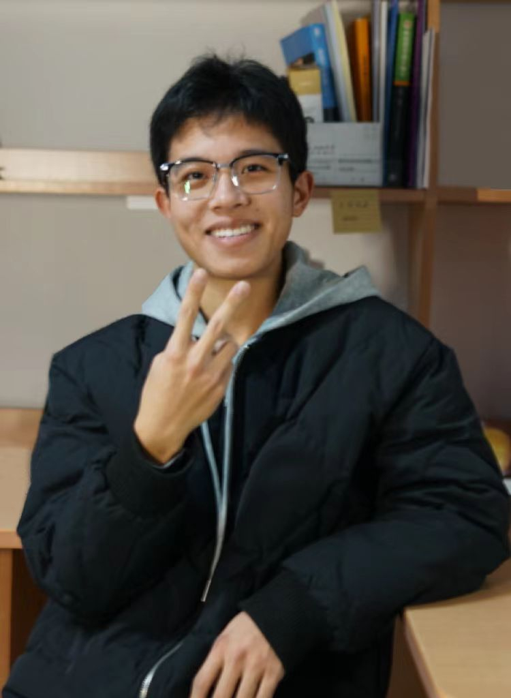

## **自我介绍**
姓名：吴泽钊  
年龄：18岁  
家乡：广东  
爱好：运动；健身  

## **算法与模型的区别**  
* **算法**：指的是用于解决问题或者执行特定指令的规则或者步骤，通常是可执行的操作流程，比如排序算法、搜索算法等  
* **模型**：指的是一个数学框架或者计算机程序，通常可以接受一定的输入来预测或者分类某些事件。模型通常需要通过学习大量的数据来获得。  

## **本学期生物信息学的学习计划**  
### **期望**  
1. **计算机工具**：熟练使用R、Linux来分析生物学数据，一定要勤加练习；  
2. **基因组学与转录组学**：了解基因组学、转录组学的概念与涵义；学习如何挖掘基因组、转录组的数据；  
3. **AI与机器学习**：了解机器学习与AI在真实的生物研究场景中的应用；   
4. **Teamwork**：与他人有更多的交流，打破信息壁垒，冲出“信息茧房”，在交流中进步

### **学习计划**  
* **1-4周**：熟练Linux操作系统  
    课后一定要勤加练习，将课上内容吸收到位  
    在四周内学完《鸟哥的Linux私房菜 - 基础学习篇》，并且一定要练习  
    **Practice!!!!**  
* **5-12周**：熟练使用R语言分析生物数据  
    认识基因组学、转录组学  
    **Practice!!!!**  
* **13-16周**：AI与机器学习  
    阅读python与机器学习相关的书籍，keep learning  
### **All in all，keep practicing and learning!**  
